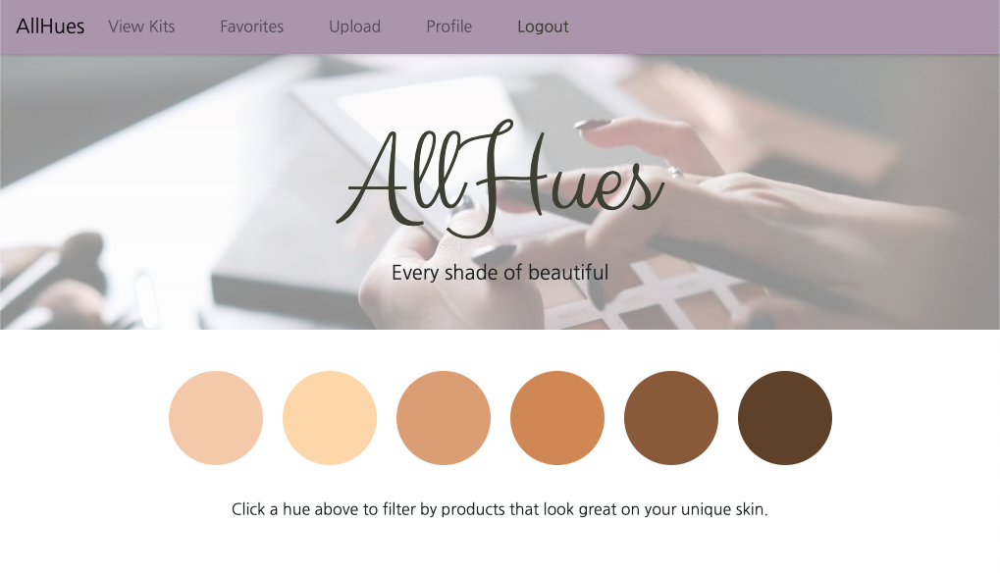

# AllHues

## Description

AllHues is a portal for content creators to further interact with their followers and curious makeup enthusiasts. Find the actual products being used and where you can buy them at https://allhues.herokuapp.com/.

## Table of contents

- [Description](#Description)
- [Installation](#Installation)
- [Usage](#Usage)
- [License](#License)
- [Technologies](#Technologies)
- [Contribution](#Contribution)
- [Questions](#Questions)

## Installation

Visit https://allhues.herokuapp.com/ and sign-up or login to get full functionality.

## Usage

On the homepage, users are able to click on a hue to filter by products that are within a certain hue range.  Users may also click on "View Popular", "View All", or "View Recent" to sort through kits as they choose.  When viewing all kits on https://allhues.herokuapp.com/viewall, users may sort kits by popularity, what's trending, or what's new.  They may also filter by a specific product, such as eyeshadow.  Additionally, users have the ability to filter by a hue range.  This allows users to narrow down their search and find products and looks they love in an efficient way.  When logged into an account, users may favorite any look they like and view all of their favorites on their Favorites page.  They also have a profile page where they can upload an image of themselves. \
Content Creators have additional capabilities.  They are able to create makeup kits on the Upload page by selecting an image to upload, selecting a hue range, giving the kit a name and description, and adding URLs to link to products they used to achieve the look in the photo.  On a Content Creator's profile page, they are able to view all kits that they have created.  Kits can be updated or deleted by clicking on a kit and then clicking the respective button.  The content creator must be logged in to get access to all of these functionalities.

## License

# Technologies

- CSS
- HTML
- JavaScript
- Node.JS
- React
- MongoDB
- JWT
- Cloudinary API

## Questions

Andrew Siegel: 
siegelal@protonmail.com • 
[Andrew's Github page](https://www.github.com/siegelal7) \
Alix Webb:
alixkwebb@gmail.com • 
[Alix's Github page](https://github.com/awebb8) \
Raj Kakar: rajdeepkakar@gmail.com • 
[Raj's Github page](https://github.com/rajdeep24) \
David Pan: dpan5425@gmail.com • 
[David's Github page](https://github.com/dpan-5)